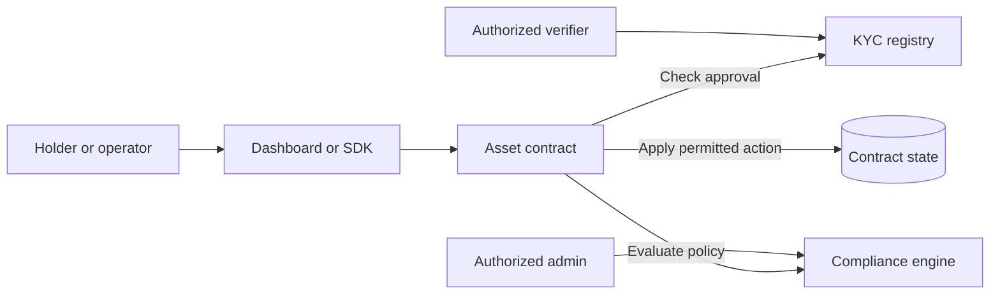

<div align="center">
  

  <h1>Real assets. Clear rules. Stellar Soroban.</h1>

  <p>Open-source building blocks for tokenized invoices, property shares, and carbon credits—with eligibility and transfer rules checked by smart contracts.</p>

  <p>
    <a href="https://vellara-x.vercel.app"><strong>Open the live preview</strong></a>
    · <a href="#get-started">Get started</a>
    · <a href="https://github.com/Vellara-Labs/Vellara/issues">Report an issue</a>
  </p>

  <p>
    <a href="https://github.com/Vellara-Labs/Vellara/actions/workflows/ci.yml"></a>
    <a href="LICENSE"></a>
    
    
  </p>
</div>

## Table of Contents

- [The idea](#the-idea)
- [Explore the building blocks](#explore-the-building-blocks)
- [How a policy check flows](#how-a-policy-check-flows)
- [Get started](#get-started)
- [Developer commands](#developer-commands)
- [Repository map](#repository-map)
- [Project roadmap](#project-roadmap)
- [Community and project docs](#community-and-project-docs)
- [Environment variables](#environment-variables)
- [Security](#security)

## The idea

Tokenizing an asset is only one part of the work. Applications may also need holder eligibility, transfer policies, and rules tied to an asset's lifecycle. Vellara brings those examples together in one inspectable Stellar Soroban repository, so builders can explore the pieces and adapt them for their own testnet prototypes.

Vellara does not verify identities or provide legal compliance. A trusted verifier records an approval decision on-chain; identity documents and the process behind that decision remain off-chain and under the deploying project's control.

## Explore the building blocks

| Building block | What it demonstrates |
| --- | --- |
| **KYC Registry** | Authorized verifiers record approval, tier, jurisdiction, and optional expiry for a Stellar address. |
| **Compliance Engine** | Transfer policy examples such as pause controls, address and jurisdiction blocklists, transfer limits, holding periods, and holder caps. |
| **Invoice Token** | Invoice metadata with issuance, transfer, settlement, and redemption examples. |
| **Property Token** | Fractional property shares with cumulative per-share dividend accounting. |
| **Carbon Credit Token** | Credit issuance, transfer, and retirement records with beneficiary metadata. |
| **RWA Reference Token** | A separate SEP-41-style token example with KYC and compliance hooks and asset metadata. |

The repository also contains a React + Vite dashboard, a TypeScript SDK, deployment helpers, Rust contract tests, and local Stellar integration tests.

## How a policy check flows



Asset contracts invoke the registry and compliance engine during relevant operations. The exact checks depend on the contract and method. An on-chain approval is a record of a verifier's decision, not proof that an off-chain identity or compliance process is adequate.

## Get started

### Requirements

- Rust toolchain and the `wasm32-unknown-unknown` target
- Stellar CLI
- Node.js 20 or newer
- Docker, if you want to run the local integration suite

### Build and test the contracts

From the repository root:

```bash
rustup target add wasm32-unknown-unknown
cargo build --release --target wasm32-unknown-unknown
cargo test --features testutils
```

### Run the dashboard

```bash
cd frontend
npm install
npm run dev
```

The interface can load without contract IDs. Network-backed workflows need the relevant `VITE_*_ID` values in `frontend/.env`. Start from [`frontend/.env.example`](frontend/.env.example). Vite variables are bundled into the browser app, so never put private keys, secrets, or identity documents in them.

### Deploy the example suite to Stellar testnet

The helper deploys the KYC registry, compliance engine, invoice token, property token, and carbon-credit token. It writes those IDs to `frontend/.env`. The separate RWA reference token is not included. The asset metadata in the script is placeholder data; review and replace it before every deployment, including testnet.

```bash
bash scripts/setup-identity.sh vellara-dev
bash scripts/deploy.sh vellara-dev
```

## Developer commands

```bash
# Rust formatting, linting, and contract unit tests


cargo fmt --all -- --check
cargo clippy --all --all-targets -- -D warnings
cargo test --features testutils

# TypeScript SDK
npm run build:sdk

# Frontend
cd frontend
npm run lint
npm run build
```

The GitHub Actions workflows run formatting, lint, contract tests, WASM builds, and a local Stellar integration job. Passing CI is useful feedback; it is not a security audit or production-readiness guarantee.

## Repository map

```text
contracts/          Soroban contracts and unit tests
frontend/           React dashboard, wallet integration, and contract clients
sdk/                TypeScript clients for application developers
scripts/            Testnet identity, deployment, and verification helpers
tests/integration/  Local Stellar integration tests
docs/               Deployment and operations guidance
```

## Project roadmap

- Verify SEP-41 compatibility of the reference token
- Expand integration coverage across asset lifecycles
- Improve deployment and operator tooling
- Publish SDK usage guides for external applications
- Commission an independent Soroban security review

## Community and project docs

- [Contributing guide](CONTRIBUTING.md)
- [Security policy](SECURITY.md)
- [Code of conduct](code-of-conduct.md)
- [Changelog](CHANGELOG.md)
- [Mainnet readiness guide](docs/mainnet-deployment.md)
- [MIT License](LICENSE)

---

Built in the open for developers exploring real-world asset applications on Stellar.

## Environment variables

Copy `.env.example` to `.env` and fill in your values (see the file for inline docs). Key groups:

| Variable group | Key variables |
| --- | --- |
| Contract access | `STELLAR_RPC_URL` |

## Security

- **Never commit secrets** — keep keys, seed phrases, and `.env` files out of source control.
- **Testnet values have no real-world value**; treat testnet deployments as experimental.
- **Keys never leave the wallet** — signing is delegated to the user's Stellar wallet; the app does not store secret keys.
- Report vulnerabilities per `SECURITY.md` where present rather than opening a public issue.

## License

MIT — see [`LICENSE`](LICENSE).
